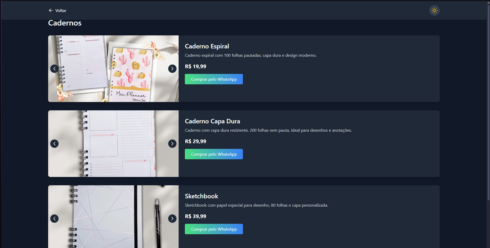
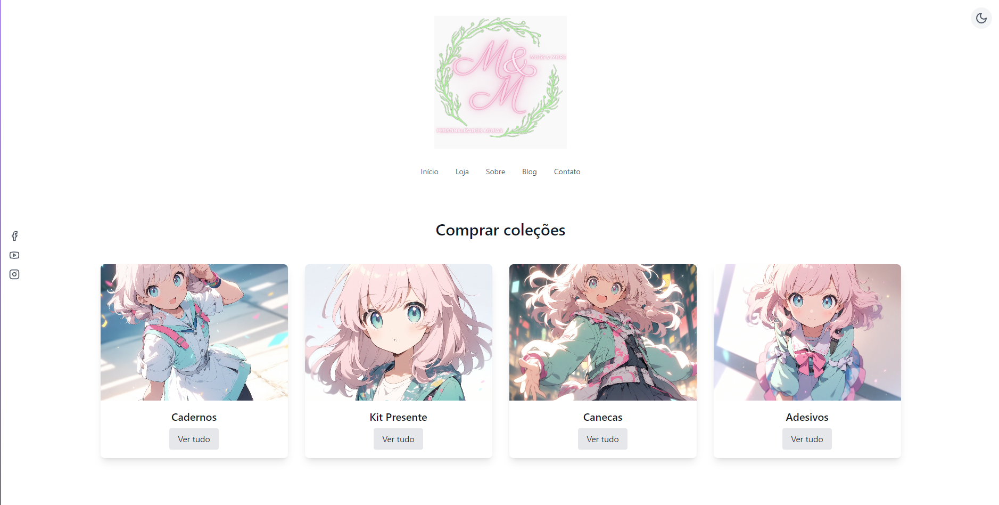

# Mugs & More 🏷️✨

## Desenvolvido por: **Andre Junior** 🎨

Bem-vindo ao **Mugs & More**, um site de loja online para **produtos personalizados**, como **canecas**, **cadernos** e muito mais! 🌟 O objetivo é oferecer uma experiência única aos nossos clientes com designs exclusivos e uma navegação simples e intuitiva.

---

### Funcionalidades 🚀

- 🌚 **Modo Escuro**: Troque entre o modo claro e escuro para uma experiência de visualização mais confortável, sem forçar os olhos.  
- 🎁 **Coleções de Produtos**: Explore diferentes categorias de produtos, como cadernos, canecas e presentes.  
- 💬 **Compra Fácil**: Ao clicar no botão de "Comprar pelo WhatsApp", você pode fazer sua compra diretamente no aplicativo de mensagens.  
- 📱 **Design Responsivo**: O site é 100% adaptável para dispositivos móveis, garantindo uma navegação suave em qualquer tamanho de tela.

---

### Imagens do Projeto 📸

Aqui estão algumas imagens do site para você visualizar melhor o layout:

  
*Exemplo de uma das páginas de produto.* 😍

  
*Outro exemplo de layout do site.* 💻

---

## Começando 🚀

Este projeto foi criado usando [Create React App](https://github.com/facebook/create-react-app) para facilitar a construção de uma aplicação React de maneira rápida e sem complicação. 😉

### Scripts disponíveis 📝

No diretório do projeto, você pode rodar os seguintes comandos:

#### `npm start`

Executa o app em modo de desenvolvimento.  
Abra [http://localhost:3000](http://localhost:3000) para visualizar no seu navegador. 🖥️

#### `npm test`

Executa os testes no modo interativo. 🧪

#### `npm run build`

Cria a versão otimizada do projeto para produção. 🚀

#### `npm run eject`

**Nota**: Este comando é irreversível! Ele ejetará a configuração do projeto para um controle total, mas só use se souber o que está fazendo. ⚠️

---

### Como Contribuir 🤝

1. **Clone o repositório**: `git clone https://github.com/seu-usuario/mugs-and-more.git`
2. **Instale as dependências**: `npm install`
3. **Execute o projeto**: `npm start`
4. **Crie uma branch para suas alterações**: `git checkout -b minha-branch`
5. **Faça o commit e envie para o repositório**: `git commit -am "Mensagem do commit"` e `git push origin minha-branch`

---

### Aprenda Mais 📚

Para aprender mais sobre o React e como o aplicativo foi estruturado, você pode conferir os seguintes links:

- [Documentação do React](https://reactjs.org/)  
- [Create React App - Getting Started](https://facebook.github.io/create-react-app/docs/getting-started)  

---

## Licença 📄

Este projeto é licenciado sob a MIT License - veja o [LICENSE.md](LICENSE.md) para mais detalhes. 🛡️

---

🛒 **Aproveite suas compras na Mugs & More!** 🎉
